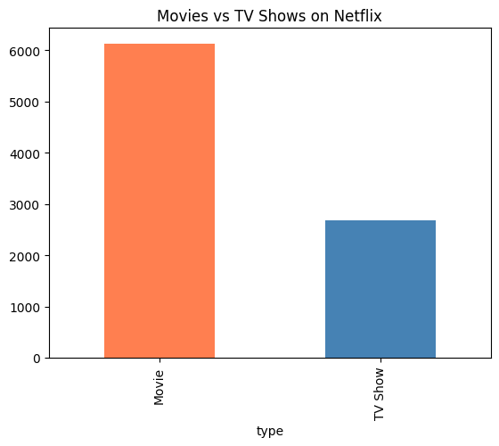
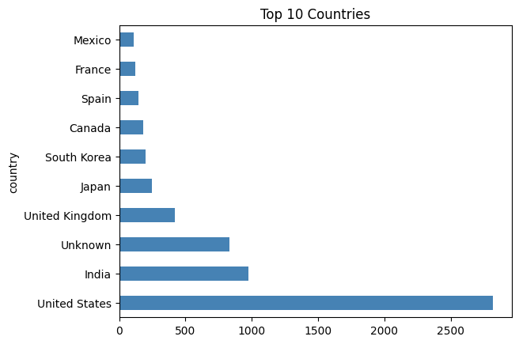
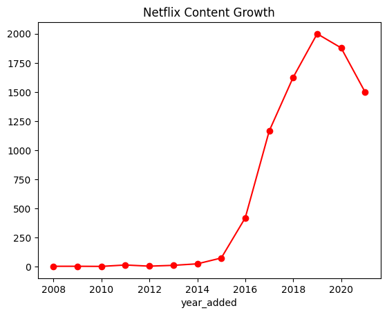
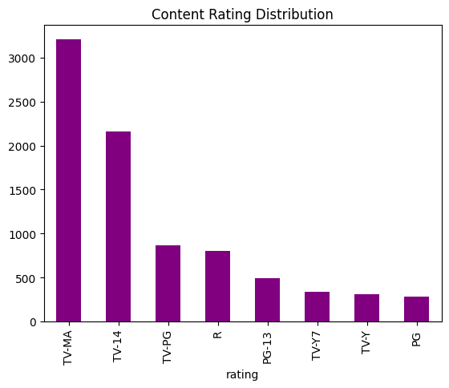
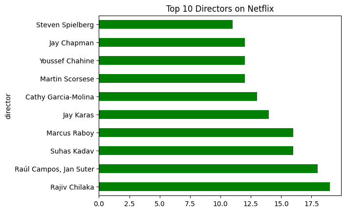
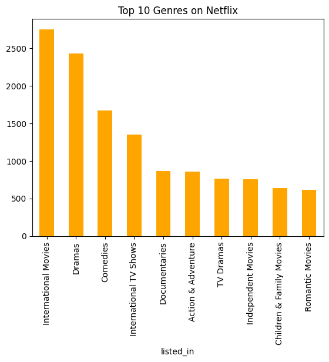

#  Netflix Content Analysis

##  Project Overview
Exploratory Data Analysis (EDA) of Netflix's content library using Python.
The goal is to uncover trends and insights about Netflix's content strategy.

##  Dataset
- Source: [Kaggle - Netflix Shows](https://www.kaggle.com/datasets/shivamb/netflix-shows)
- 8,800+ titles with information on type, country, director, genre, rating and more

## Tools & Libraries
- Python
- Pandas
- Matplotlib
- Seaborn
- Jupyter Notebook / Google Colab

## Key Insights
1. Movies make up nearly 70% of all Netflix content
2. USA produces the most content, followed by India
3. Netflix content grew rapidly after 2015, peaking around 2019-2020
4. Most content is rated TV-MA, targeting adult audiences
5. Rajiv Chilaka is the most featured director with 19 titles
6. International Movies is the #1 genre with 2700+ titles

##  Visualizations
- Movies vs TV Shows distribution
- Top 10 content producing countries
- Netflix content growth over the years
- Content rating distribution
- Top 10 directors
- Top 10 genres

## 👤 Author
 Md Jalal Abedin [https://www.linkedin.com/in/jalal-abedin/]

## 📈 Visualizations

